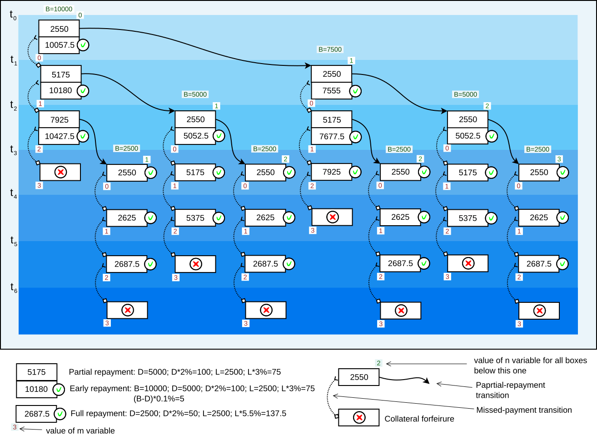
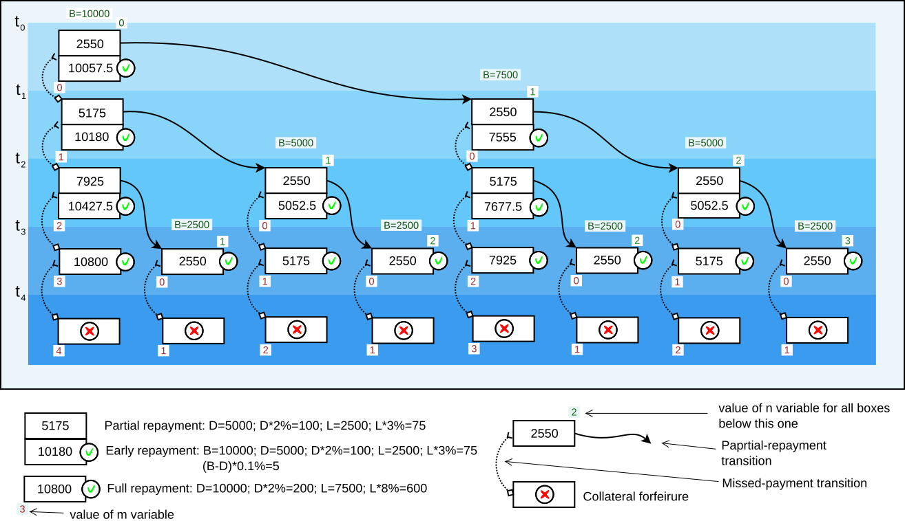

.. role:: m(math)

.. role:: raw-latex(raw)
    :format: latex

:raw-latex:`\documentclass{article}\usepackage{amsmath}`

:raw-latex:`\begin{document}`

.. pandoc uses \tightlist but doesn't inclue it in generated latex document

:raw-latex:`\providecommand{\tightlist}{\setlength{\itemsep}{0pt}\setlength{\parskip}{0pt}}`

Asset-Based Lending smart contract
----------------------------------

Author: Dmitry Petukhov (https://github.com/dgpv) (C) 2020

With review and help from Russell O'Connor

.. begin-spec

Contract premise
^^^^^^^^^^^^^^^^

Alice possesses certain quantity of asset `Principal_Asset` that she does not
currently utilize, but wants to extract some value from.

Bob possesses asset `Collateral_Asset`, but needs some :m:`P` amount of
asset `Principal_Asset` temporarily.

Bob does not want to sell `Collateral_Asset`, because he predicts that its value or
utility will be higher in the future than what the current market value,
for tax reasons, etc.

Bob is willing to pay the for the temporary use of :m:`P`
while offering :m:`C` amount of `Collateral_Asset` as a guarantee
of repayment to the creditor.

Contract can be terminated at any time by any settlement that is mutually agreed
by the two parties.

Basic Asset-Based Loan contract
^^^^^^^^^^^^^^^^^^^^^^^^^^^^^^^

:m:`t_{0}` is the point in time when contract begins

:m:`t_{1}` is the point in time when the pre-agreed duration 
has passed since :m:`t_{0}`

Interest rate :m:`R` is pre-agreed

Alice is willing to give out :m:`P` to Bob, provided
that:

- Before :m:`t_{1}`, she will receive :m:`P + P * R`
- Otherwise, at or after :m:`t_{1}`, she will be able to claim :m:`C`

Bob is willing to freeze :m:`C` for certain period, provided
that:

- He will receive :m:`P` immediately
- If :m:`P + I` is repaid before :m:`t_{1}`, he can recieive :m:`C` back

Bob agrees that if :m:`P + I` is not repaid before :m:`t_{1}`,
Alice can claim :m:`C` for herself.

To enter the contract, Alice and Bob create and cooperatively sign a transaction
that:

- Sends :m:`P`, provided by Alice, to Bob's address
- Sends :m:`C`, provided by Bob, to the address of a script
  that enforces the terms of the contract above

This contract is simple, but limited. It requires for principal to be repaid in
one lump sum, it is often preferable for the principal to be repaid in portions
over time.

Asset-Based Loan contract with partial repayments
^^^^^^^^^^^^^^^^^^^^^^^^^^^^^^^^^^^^^^^^^^^^^^^^^

The repayment is split into :m:`N` installments.

:m:`M` consecutive missed payments lead to collateral forfeiture.

The contract ends in maximum :m:`S \in [\max\{N, M\}+1, N + M]`
number of steps.

The concrete value of :m:`S` within this range is pre-agreed.

The rates used for calculation of interest or surcharge are pre-agreed:

- :m:`R_{D}` is the rate for regular repayments *due*
- :m:`R_{E}` is the rate for surcharge on *early* repayments
- :m:`R_{C}` is the rate for penalty on part of collateral returned on default
- :m:`R_{L(1)} \ldots R_{L(M-1)}` are the rates for surcharge on *late* repayment: :m:`R_{L(1)}` is applied when one payment is missed, :m:`R_{L(2)}` is applied when two consecutive payments are missed, and so on

:m:`n` is the number of partial repayments, :m:`n \in [0, N]`

:m:`m` is the number of missed payments, :m:`m \in [0, M]`

:m:`B` is the outstanding principal balance

:m:`F_{P} = \frac{P}{N}` is installment size (the "Fraction of :m:`P`")

:m:`D = \min\{F_{P} * (m+1), B\}` is the portion of the balance currently *due*
to be repaid [#D_remainder]_

:m:`L = \min\{F_{P} * m, B\}` is the amount the repayment is *late* on

The contract can progress over total :m:`S` time periods,
and :m:`t_{0} \ldots t_{S-1}` are the points in time at the beginning
of each period.

At :m:`t_{0}`:

- :m:`n = 0`
- :m:`m = 0`
- :m:`B = P`

Alice is willing to give out :m:`P` to Bob, provided
that:

- Before each :m:`t_{s}, s \in [1, S-1]` she will receive
  :m:`A_{reg} = D + D * R_{D} + L * R_{L(m)}` where :m:`A_{reg}`
  is a regular repayment amount, and then:

    - :m:`n` will be incremented
    - :m:`m` will be reset to 0
    - :m:`B` will be decreased by :m:`D`

- Otherwise, :m:`m` will be incremented

- If :m:`m \geq M`, or after :m:`t_{s}, s \geq S-1`,
  she will be able to claim :m:`C`

Alice agrees that before :m:`t_{N-1}`, :m:`B` can be set to 0 if Bob repays
:m:`A_{early} = B + D * R_{D} + (B-D)*R_{E} + L * R_{L(m)}` where :m:`A_{early}`
is an early repayment amount

Bob is willing to freeze :m:`C` for certain period, provided that:

- He will receive :m:`P` immediately
- When the condition :m:`B=0` is reached during contract execution,
  he can receive :m:`C` back

Bob agrees that Alice can claim a portion :m:`C` for herself if the condition
:m:`m \geq M` is reached during contract execution, or after
:m:`t_{s}, s \geq S-1` point in time is reached.
A portion of :m:`C` that Alice can claim in this case will be dependent on the
amount of principal that was repaid previously, and will equal to
:m:`C_{forfeit} = \max\{1, \min\{C, C * A_{owed} \div P\}\}`
where :m:`A_{owed} = \max\{ B, A_{reg} + A_{reg} * R_{C}\}` and Bob will receive
:m:`C - C_{forfeit}` portion of the collateral back

To enter the contract, Alice and Bob create and cooperatively sign a transaction
that:

- Sends :m:`P`, provided by Alice, to Bob's address
- Sends :m:`C`, provided by Bob, to the address of a script
  that enforces the terms of the contract above

Examples
~~~~~~~~

Calculated amounts on the presented schemes are rounded down.

The following scheme illustrates the contract with:

- :m:`P = 10000`, :m:`C = 1000`
- :m:`N = 4`, :m:`M = 3`, :m:`S=7`
- :m:`R_{D} = 0.02, R_{E} = 0.001, R_{C} = 0.1, R_{L} = (0.03, 0.055)`,
  corresponts to 2%, 0.1%, 10%, (3%, 5.5%)

----

The following scheme illustrates the contract with:

- :m:`P = 10000`, :m:`C = 1000`
- :m:`N = 4`, :m:`M = 4`, :m:`S=4`
- :m:`R_{D} = 0.02, R_{E} = 0.001, R_{C} = 0.1, R_{L} = (0.03, 0.055, 0.08)`,
  corresponts to 2%, 0.1%, 10%, (3%, 5.5%, 8%)

The layout with :m:`N=M=S` allows to have the
collateral forfeiture event to always happen in one particular period.

----

.. [#D_remainder] With presented simple formula, :m:`D` for the last repayment equals
    :m:`P \bmod N`.

    In most cases :m:`P` will likely be much larger than :m:`N`,
    and last repayment will be very small in this case.
    Simpler formula is easier for understanding, but for real application,
    it makes sense to just make the last repayment slightly bigger than others,
    and the more complex formula should be used:

    .. math::
        D = \begin{cases}
                F_{P}*(m+1) & \text{if $ (F_{P}*(m+1) + P \bmod N) \geq B $} \\[1ex]%
                B & \text{otherwise}
            \end{cases}

.. end-spec

:raw-latex:`\begin{end}`
